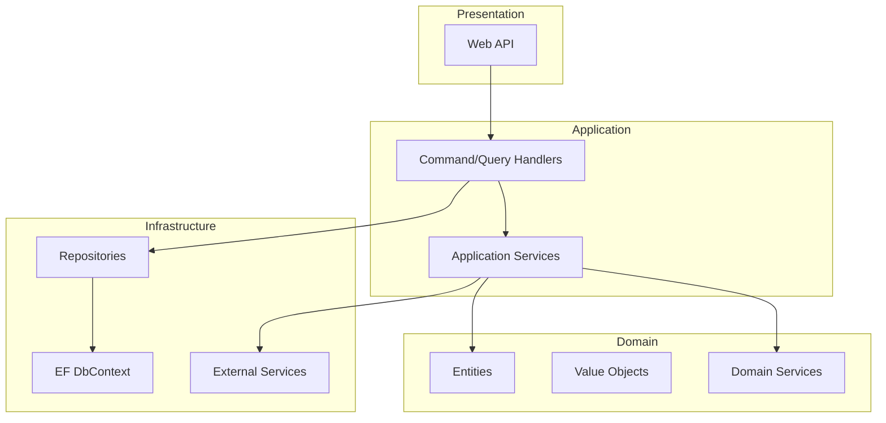
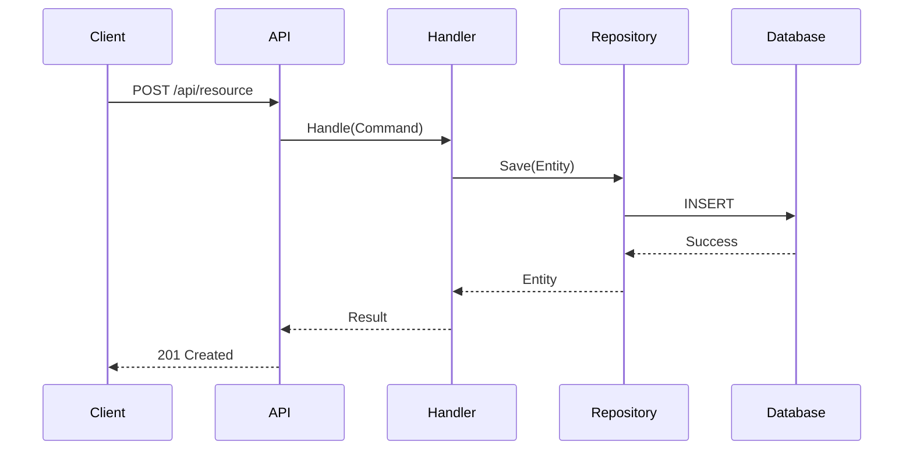

# Architecture Documentation Prompt

Use this prompt structure when generating architecture documentation.

## Context to Gather First

Before writing, ensure you have:
1. Output from `scan_dotnet.py` (project structure, patterns, frameworks)
2. Contents of key files:
   - Program.cs or Startup.cs
   - Any dependency injection configuration
   - Main domain entities
3. The project's existing README.md (if any)

## Prompt Template

```
Based on my analysis of this .NET codebase, generate an Architecture Overview document.

## Codebase Analysis Results
[Paste scan_dotnet.py JSON output]

## Key File Contents
[Paste relevant file contents]

## Requirements for the Document

1. **Purpose Section**
   - What problem does this system solve?
   - Who are the primary users/consumers?
   - What are the key capabilities?

2. **Architecture Diagram**
   - Create a Mermaid diagram showing major components
   - Show data flow between components
   - Indicate external dependencies

3. **Project Structure Table**
   - List each project with its purpose
   - Show dependencies between projects
   - Identify the architectural layer (Domain, Application, Infrastructure, etc.)

4. **Design Patterns**
   - Document each detected pattern
   - Explain why it's used in this context
   - Show a concrete code example from the codebase

5. **Technology Stack**
   - List frameworks with versions
   - Note any significant NuGet packages
   - Explain technology choices if evident

6. **Key Design Decisions**
   - Infer architectural decisions from the code structure
   - Document any non-obvious patterns
   - Note tradeoffs if apparent

## Output Format
- Markdown with proper heading hierarchy
- Mermaid diagrams in fenced code blocks
- Code examples with file path references
- Tables for structured information
```

## Example Mermaid Diagrams

### Component Diagram


### Sequence Diagram (for key flows)


## Quality Checklist

Before finalizing architecture documentation, verify:

- [ ] Diagram accurately reflects project structure
- [ ] All projects from scan results are documented
- [ ] Detected patterns are explained with examples
- [ ] Technology choices are listed
- [ ] No placeholder text remains
- [ ] File path references are accurate
- [ ] Code examples are from the actual codebase
