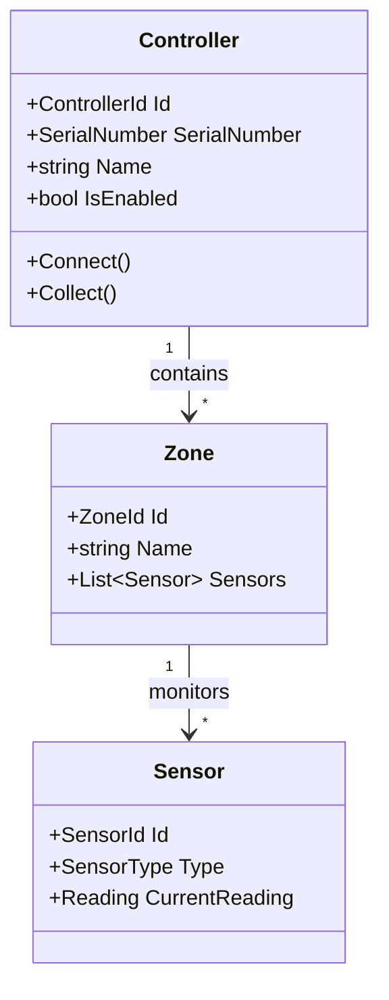

# Domain Model Documentation Prompt

Use this prompt structure when generating domain model documentation for DDD-style codebases.

## Context to Gather First

Before writing, ensure you have:
1. Output from `scan_dotnet.py` (especially detected patterns and namespaces)
2. Contents of Domain/Core project files:
   - Entity classes
   - Value Objects
   - Aggregate Roots
   - Domain Events
   - Domain Services
3. Any specification or validation classes

## Prompt Template

```
Based on my analysis of this .NET codebase using Domain-Driven Design patterns, generate Domain Model documentation.

## Codebase Analysis Results
[Paste scan_dotnet.py JSON output, especially namespaces from Domain project]

## Domain Entity Code
[Paste entity class definitions]

## Value Object Code
[Paste value object definitions]

## Domain Event Code (if applicable)
[Paste domain event definitions]

## Requirements for the Document

1. **Domain Overview**
   - What business domain does this model represent?
   - What are the key business concepts?
   - Ubiquitous language glossary

2. **Bounded Contexts** (if multiple)
   - Identify distinct bounded contexts
   - Relationships between contexts
   - Context map diagram

3. **Aggregates**
   For each aggregate:
   - Aggregate root entity
   - Child entities
   - Value objects within the aggregate
   - Invariants enforced
   - Lifecycle diagram (if complex)

4. **Entities**
   For each entity:
   - Purpose and business meaning
   - Key properties
   - Behaviors (methods)
   - Relationships to other entities

5. **Value Objects**
   For each value object:
   - What concept it represents
   - Validation rules
   - Equality semantics

6. **Domain Events** (if applicable)
   - Event types
   - When each is raised
   - Expected handlers/subscribers

7. **Domain Services**
   - Operations that don't belong to entities
   - Business rules they encapsulate

## Output Format
- Mermaid class diagrams for relationships
- Tables for property listings
- Code examples for key behaviors
- Glossary for ubiquitous language
```

## Template Structure

```markdown
# Domain Model

## Overview

This document describes the domain model for [System Name], which models [business domain description].

## Ubiquitous Language

| Term | Definition |
|------|------------|
| Controller | A hardware device that monitors environmental conditions |
| Collection | The process of gathering data from a controller |
| Zone | A logical grouping of monitoring points |

## Domain Diagram



## Aggregates

### Controller Aggregate

The Controller aggregate is the root entity for managing hardware controller devices.

**Aggregate Root**: `Controller`

**Invariants**:
- A controller must have a valid serial number
- A controller cannot have duplicate zone names
- Collection can only occur when the controller is connected

**Entities**:
- `Zone` - A logical grouping within the controller
- `Sensor` - An individual monitoring point

**Value Objects**:
- `SerialNumber` - Unique identifier for the hardware
- `Reading` - A sensor measurement with timestamp

```csharp
// Example: Controller aggregate root
public class Controller : AggregateRoot<ControllerId>
{
    public SerialNumber SerialNumber { get; private set; }
    public string Name { get; private set; }
    
    private readonly List<Zone> _zones = new();
    public IReadOnlyList<Zone> Zones => _zones.AsReadOnly();
    
    public void AddZone(string name)
    {
        if (_zones.Any(z => z.Name == name))
            throw new DomainException("Zone name must be unique");
            
        _zones.Add(new Zone(name));
        AddDomainEvent(new ZoneAddedEvent(Id, name));
    }
}
```

## Entities

### Controller

**Purpose**: Represents a physical hardware controller device.

| Property | Type | Description |
|----------|------|-------------|
| Id | ControllerId | Unique identifier |
| SerialNumber | SerialNumber | Hardware serial number |
| Name | string | Display name |
| IsEnabled | bool | Whether controller is active |
| Zones | IReadOnlyList<Zone> | Monitored zones |

**Behaviors**:
- `Connect()` - Establishes connection to hardware
- `Disconnect()` - Closes hardware connection
- `Collect()` - Gathers current data from all sensors

### Zone

**Purpose**: A logical grouping of sensors within a controller.

[... continue for each entity ...]

## Value Objects

### SerialNumber

**Represents**: The unique hardware identifier assigned by the manufacturer.

**Validation Rules**:
- Must be exactly 10 characters
- Must match pattern: `[A-Z]{2}[0-9]{8}`

```csharp
public class SerialNumber : ValueObject
{
    public string Value { get; }
    
    public SerialNumber(string value)
    {
        if (!Regex.IsMatch(value, @"^[A-Z]{2}[0-9]{8}$"))
            throw new ArgumentException("Invalid serial number format");
        Value = value;
    }
    
    protected override IEnumerable<object> GetEqualityComponents()
    {
        yield return Value;
    }
}
```

### Reading

**Represents**: A sensor measurement at a point in time.

**Properties**:
| Property | Type | Description |
|----------|------|-------------|
| Value | decimal | The measured value |
| Unit | MeasurementUnit | Unit of measurement |
| Timestamp | DateTimeOffset | When measurement was taken |

**Immutability**: Readings are immutable once created.

## Domain Events

| Event | Raised When | Key Data |
|-------|-------------|----------|
| ControllerConnectedEvent | Controller establishes connection | ControllerId, Timestamp |
| CollectionCompletedEvent | Data collection finishes | ControllerId, RecordCount |
| SensorAlertEvent | Sensor reading exceeds threshold | SensorId, Reading, Threshold |

### CollectionCompletedEvent

```csharp
public class CollectionCompletedEvent : DomainEvent
{
    public ControllerId ControllerId { get; }
    public int RecordCount { get; }
    public DateTimeOffset CompletedAt { get; }
    
    public CollectionCompletedEvent(
        ControllerId controllerId, 
        int recordCount)
    {
        ControllerId = controllerId;
        RecordCount = recordCount;
        CompletedAt = DateTimeOffset.UtcNow;
    }
}
```

## Domain Services

### CollectionService

**Purpose**: Orchestrates the data collection process across multiple controllers.

**Operations**:
- `CollectFromController(ControllerId)` - Collect from single controller
- `CollectFromAll()` - Collect from all enabled controllers
- `ValidateCollectionResults(results)` - Ensure data integrity

```csharp
public class CollectionService : IDomainService
{
    public async Task<CollectionResult> CollectFromController(
        Controller controller,
        CancellationToken cancellationToken)
    {
        // Domain logic for collection
    }
}
```
```

## Quality Checklist

Before finalizing domain model documentation, verify:

- [ ] All aggregates from the codebase are documented
- [ ] Ubiquitous language terms match code naming
- [ ] Class diagrams reflect actual relationships
- [ ] Invariants are identified and documented
- [ ] Code examples are from actual codebase
- [ ] Value object validation rules are accurate
- [ ] Domain events list is complete
