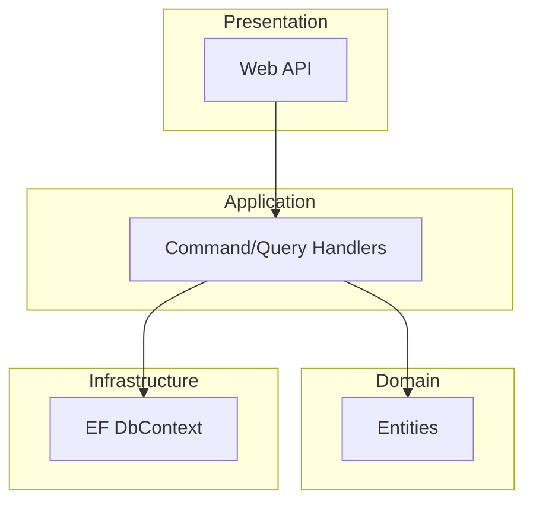
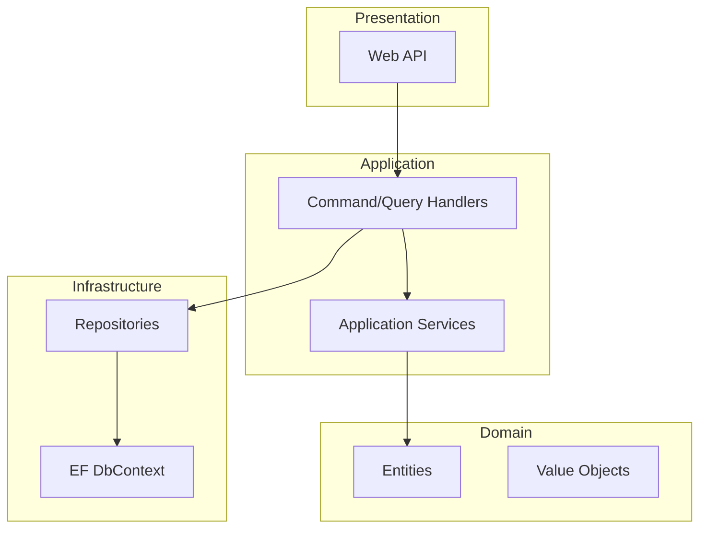
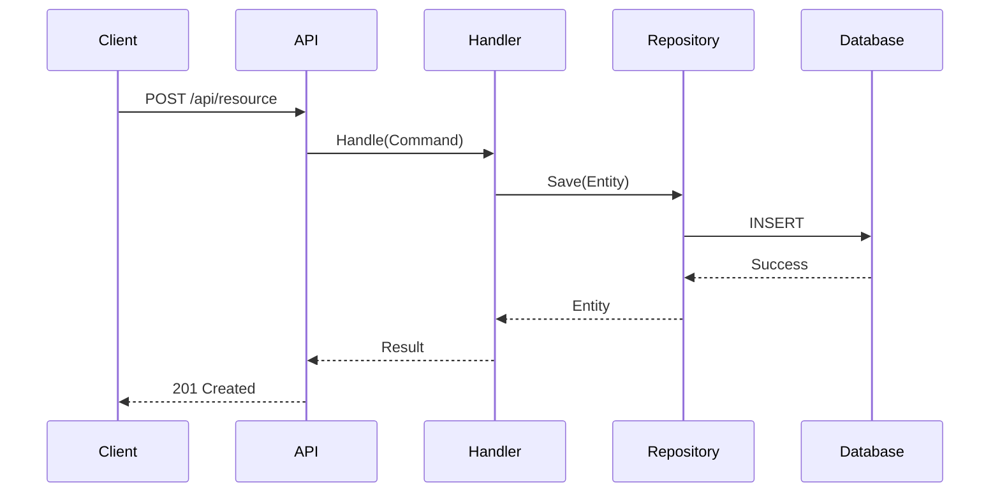

# Architecture Documentation Template

## Required Context

Before writing, gather:
1. Output from `scan_dotnet.py` (structure, patterns, frameworks)
2. Key files: Program.cs/Startup.cs, DI configuration, domain entities
3. Existing README.md

## Document Structure

```markdown
# Architecture Overview

## Purpose
[One paragraph: what the system does, why it exists]

## High-Level Architecture



## Project Structure

| Project | Purpose | Dependencies |
|---------|---------|--------------|
| ProjectName.Domain | Core business logic | None |
| ProjectName.Application | Use cases, interfaces | Domain |
| ProjectName.Infrastructure | Data access, external services | Application |
| ProjectName.Api | HTTP endpoints | Application |

## Key Patterns

### [Pattern Name]
[Explanation with code example from codebase]

## Technology Stack
- **Framework**: .NET 8
- **Database**: [from analysis]
- **Messaging**: [if applicable]
```

## Mermaid Templates

### Component Diagram


### Sequence Diagram


## Quality Checklist

- [ ] Diagram reflects actual project structure
- [ ] All projects documented
- [ ] Patterns explained with real code examples
- [ ] Technology choices listed
- [ ] No placeholder text
