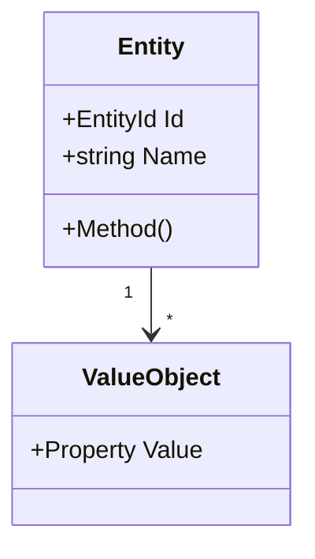

# Domain Model Documentation Template

## Required Context

Before writing, gather:
1. Output from `scan_dotnet.py` (detected DDD patterns)
2. Domain/Core project files: Entities, Value Objects, Aggregates, Domain Events
3. Specification and validation classes

## Document Structure

```markdown
# Domain Model

## Overview
[Business domain description, key concepts]

## Ubiquitous Language
| Term | Definition |
|------|------------|
| [Term] | [Business meaning] |

## Domain Diagram



## Aggregates

### [Aggregate Name]

**Root**: `[EntityName]`

**Invariants**:
- [Business rule 1]
- [Business rule 2]

**Entities**: [List]
**Value Objects**: [List]

```csharp
// Example from codebase
public class AggregateRoot : Entity<Id>
{
    // Key code
}
```

## Entities

### [Entity Name]

**Purpose**: [Business meaning]

| Property | Type | Description |
|----------|------|-------------|
| Id | EntityId | Unique identifier |

**Behaviors**: [Methods and their purpose]

## Value Objects

### [Value Object Name]

**Represents**: [Concept]
**Validation**: [Rules]
**Immutability**: [Confirmed]

## Domain Events

| Event | Raised When | Key Data |
|-------|-------------|----------|
| [EventName] | [Trigger] | [Properties] |
```

## Quality Checklist

- [ ] All aggregates documented
- [ ] Ubiquitous language matches code naming
- [ ] Class diagrams reflect actual relationships
- [ ] Invariants identified
- [ ] Code examples from actual codebase
